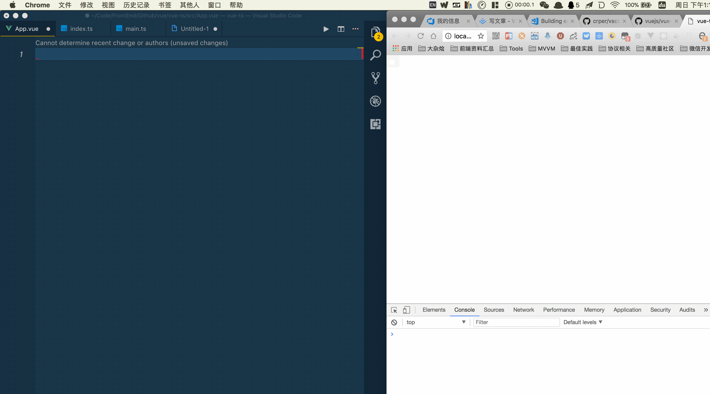

# 前言

节省你的时间,方便你的使用..好记忆的代码片断;

来感受`typescript`的美妙之处!!

支持后缀`.vue`,`.ts`,`.js`文件使用

代码片段的范围

- `vue`
- `vue-router`
- `vuex`


---

# 效果




# 安装

直接在`VSCode`商店搜索`vscode-vue-ts-snippet`;


----

# 使用姿势

**前缀解释**

- `vt-`: vue+typescript, 只是单纯为了好记忆

**代码片段涵盖的范围**


- `vt-base`

```javascript
<template>
</template>


<script lang="ts">

   import Vue from "vue"
   import Component from "vue-class-component"

  @Component({})
  export default class  extends Vue{
  //variable=>data
  message: string = "data variable";
  //computed?
  get testComputeVariable(){}
  // lifecycle?
  created(){}
  //methods?
  estFn(){}

}


<style scoped>
</style>
```


# 最后

这个仓库伴随我写的某一篇水文诞生的

精力有限,所以不定时更新吧...大佬们也可以帮我完善下;
还有这代码片段可能随时会阉割!!!
所有装饰器的都是依赖官方维护的这个库;

 - [vue-class-component](https://github.com/vuejs/vue-class-component)

体验了下,感觉还不错,但是还有挺多局限了,写起来不如 `ng4`那样畅快;

若是最近不更新的话,那就可能春节后再考虑更新这个库了...看看这个库是否更完善了
